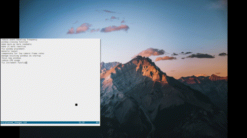

# FTWM

An experimental window manager with which you can pan a virtual desktop by moving your head.

## Status

It's somewhat usable. Some critical features are missing, like fullscreen handling. See below for limitations and known issues.

## Features

- You can pan the windows using your face!

- It has DBus interface which can be controlled using the included `ftwmcmd` script, which can be used in keyboard shortcuts using something like xbindkeys.

- Click to focus

- Optimal window arrangement

- Configuration via a `.ini` file

- Automatically selects the first camera that can see your face

- Windows completely stop moving when your head is still

## Limitations and Known Issues

The following issues include bugs and missing features that I plan to fix.

### fullscreen applications

Fullscreen applications may not take up the whole screen, nor will they be static.

### existing window management

Windows opened before the application has finished loading are unmanaged. As a workaround, I put a delay in my `.xinitrc` before any startup GUI applications load.

### window placement

New windows may be difficult to find. Currently all new windows are placed wherever there is room, and if there's a lot of windows on the screen already, you'll have to look around to find them. Also, there is a bug where empty space is counted as occupied, causing windows to be placed in sub-optimal locations. As a workaround, when this happens, just re-arrange the windows.

### cpu usage

It uses up to about 17% of the CPU on my machine, or about 1.36 cores.

### window resizing

Changing the window sizes is supposed to be smarter than it is now. Currently I can resize them by 20% at a time using the keyboard, but this is supposed to vary so you can get closer to the exact size you want.

## Configuration

The `settings.ini` file, located by default in `~/.config/ftwm`, includes options to tune the smoothness of window movements, customize how far you can move them, and specify the threshold at which stillness is detected. There are also some camera settings. Details are in the included `settings.ini` file.

## Roadmap

1. Fullscreen handling

2. Monocle layout

3. Panning toggle action

4. Close-all-windows action

5. Calibration: re-center the windows so you don't have to adjust the screen

6. Mouse-only panning mode, in case you can't sit still

7. Remember window sizes

8. Handle floating windows

9. Hot reload settings

10. Zoom in and out with your face (maybe)

11. Fix window placement

12. Manage existing windows on startup

13. Support _NET_ACTIVE_WINDOW

14. Installer

15. Point to new windows

16. Focus new windows

17. Reduce CPU usage

18. Improve window-resizing

19. Dock support

## Change Log

### Version 3

- Add a setting for changing the event handling rate

- Window-killing functionality

- Compensate for low camera framerates

- Some refactoring
